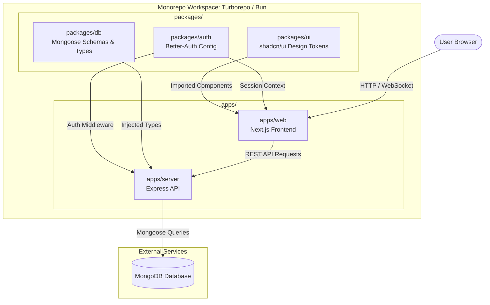

# chatapp

A simple real time chat app. I chose to make a chat app to hone my skills using websockets and a chance to get a bit more advanced experience with mongoDB. Among other things, this is also expanding my hands on knowledge of Tanstack, Bun and Shadcn/ui. As well as deeper exploritory useage of Tailwined and Next.js. The list of tech used is below for reference.

## Features

- **TypeScript** - a strongly typed, open-source, super set of javascript, developed by Microsoft.
- **Next.js** - an open-source, full-stack framework built on top of React that allows the creation of high-quality, fast, and SEO-friendly web apps.
- **TailwindCSS** - a utility-first CSS framework designed for rapidly building modern websites/apps.
- **Shared UI package** - a highly popular, open-source, fully customable collection of reusable React components.
- **Express** - a minimal, flexible, and open-source backend web application framework for Node.js.
- **Bun** - an incredibly fast, all-in-one JavaScript/TypeScript runtime, bundler, test runner, and package manager designed as a replacement for Node.js
- **Mongoose** - an Object Data Modeling (ODM) library for Node.js that manages between data, provides schema validation, and translates objects in your code and in the MongoDB database.
- **MongoDB** - a popular, open-source, NoSQL (non-relational) document database.
- **Authentication** - the "better" authentication choice and one of the most highly recommended solutions in the JavaScript ecosystem.
- **PM2** - a production-grade process manager for Node.js and Bun applications.

## Getting Started

First, install the dependencies:

```bash
bun install
```

## Database Setup

This project uses MongoDB with Mongoose.

1. Make sure you have MongoDB set up.
2. Create your `apps/server/.env` file with your MongoDB connection URI.

Then, run the development server:

```bash
bun run dev
```

Open [http://localhost:3001](http://localhost:3001) in your browser to see the web application.
The API is running at [http://localhost:3000](http://localhost:3000).

## UI Customization

React web apps in this stack share shadcn/ui primitives through `packages/ui`.

- Change design tokens and global styles in `packages/ui/src/styles/globals.css`
- Update shared primitives in `packages/ui/src/components/*`
- Adjust shadcn aliases or style config in `packages/ui/components.json` and `apps/web/components.json`

### Add more shared components

Run this from the project root to add more primitives to the shared UI package:

```bash
npx shadcn@latest add accordion dialog popover sheet table -c packages/ui
```

Import shared components like this:

```tsx
import { Button } from "@chatapp/ui/components/button";
```

### Add app-specific blocks

If you want to add app-specific blocks instead of shared primitives, run the shadcn CLI from `apps/web`.

## Project Structure

```
chatapp/
├── apps/
│   ├── web/         # Frontend application (Next.js)
│   └── server/      # Backend API (Express)
├── packages/
│   ├── ui/          # Shared shadcn/ui components and styles
│   ├── auth/        # Authentication configuration & logic
│   └── db/          # Database schema & queries
```

## Available Scripts

- `bun run dev`: Start all applications in development mode
- `bun run build`: Build all applications
- `bun run start`: Uses PM2 to start all apps for production
- `bun run dev:web`: Start only the web application
- `bun run dev:server`: Start only the server
- `bun run check-types`: Check TypeScript types across all apps


<details>
<summary>Click to view/hide diagram</summary>

</details>